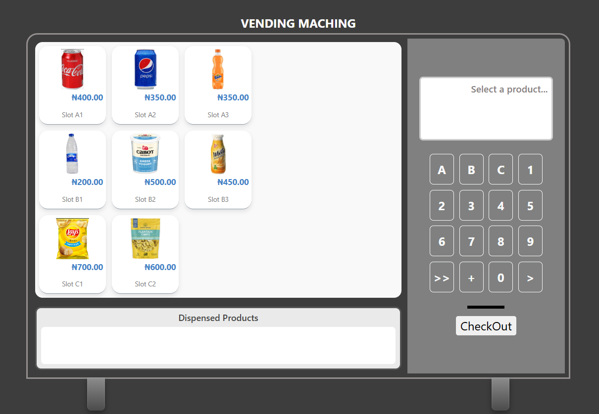

## Vending Machine

## Overview  
A fully interactive web-based **Vending Machine** application that simulates a real-world vending experience. The system allows users to browse products, select items using a keypad interface, increase quantities, complete simulated payments, and receive dispensed products visually on-screen.

The application also includes an Admin Dashboard where products can be added, updated, and managed dynamically using browser local storage without requiring a backend or database.

##  Features  

###  Key Features
Interactive vending machine UI with realistic structure and layout
Product selection using keypad slot codes (e.g. A1, B2)
Checkout and payment simulation flow
Quantity increment support for selected products
Dynamic product rendering from localStorage
Admin inventory management system
Image upload support for vending products
Category-based product organization
Product dispense tray animation
Persistent storage using browser localStorage
Responsive and modern UI design

## 🧠 Tech Stack
- **TypeScript (ES6)** – Core app logic and vending machine flow  
- **HTML5** – Page structure and content  
- **CSS3** and **Boostrap** – Styling and grid layout for the vending interface
- **LocalStorage API** – Persistent client-side data storage 

## 💾 How to Run Locally  

### Clone the Repository
```bash
git clone https://github.com/tolulope23-ops/vending-machine.git
cd vending-machine
```

### Install Dependencies (for TypeScript)
```
npm install
```
### Compile TypeScript
```
npx tsc
```

## 📸 Preview



[GitHub](https://github.com/tolulope23-ops)


