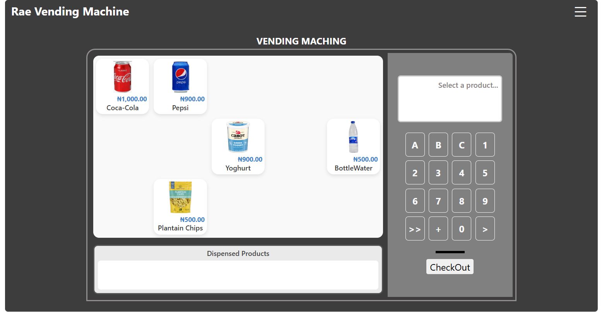

# 🧃 Vending Machine

## Overview  
The **Vending Machine** is a web-based application that simulates a real-world vending experience.  
It allows users to view and purchase products, while admins can manage inventory directly from the dashboard.

##  Features  

### 🧍 User Features
- Smooth display updates with a digital vending feel 
- View available products with name, price, and image
- Select products by click or button 
- Handles out-of-stock messages and input validation
- See total cost and make “purchase” interactions
- Initialise payment mode by clicking the **Checkout** button

### 🧑‍💼 Admin Features
- Add new products (slot, name, price, quantity, category, image)  
- Automatically saves stock in `localStorage`  
- Updates reflect instantly on the vending grid  
- Clear and intuitive UI for managing inventory 

## 🧠 Tech Stack
- **TypeScript (ES6)** – Core app logic and vending machine flow  
- **HTML5** – Page structure and content  
- **CSS3** and **Boostrap** – Styling and grid layout for the vending interface
- **LocalStorage API** – Persistent client-side data storage 

## 💾 How to Run Locally  

### 1️⃣ Clone the Repository
```bash
git clone https://github.com/tolulope23-ops/vending-machine.git
cd vending-machine
```

### Install Dependencies (for TypeScript)
```
npm install
```
### Compile TypeScript
```
npx tsc
```

## 💡 Future Improvements
- Add authentication for admin access  
- Integrate a real payment gateway (Paystack or Stripe)  
- Implement backend with a database (Node.js + PostgreSQL)

## 📸 Preview



## 👩‍💻 Author
**Racheal Adeyemi**  
Backend Developer | Tech4Dev Trainee |  Passionate about creating intuitive web tools while building secure and scalable APIs that solve real-world problems.

🔗 [LinkedIn](https://linkedin.com/in/raedev)

🐙 [GitHub](https://github.com/tolulope23-ops)

